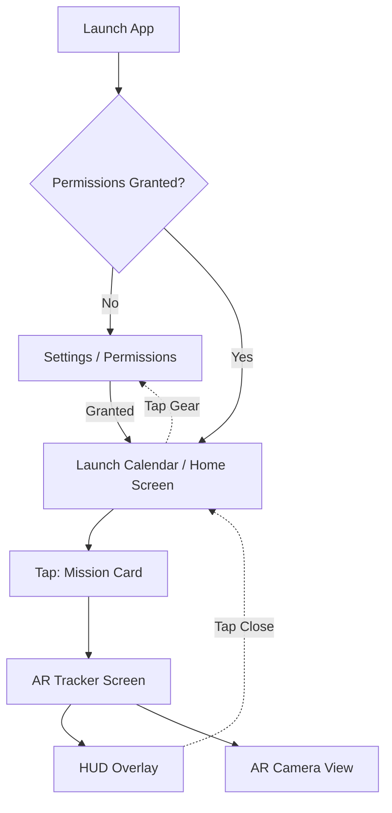

# LaunchArc Screen Breakdown

This document outlines the high-level user interface and screen flow of the LaunchArc app. 

## 1. Launch Calendar (Home Screen)
The default screen upon opening the app. This screen lists upcoming global orbital launches.

- **Header / Navigation Bar:** 
  - App title (`LaunchArc`).
  - Settings icon (gear).
- **List View (Upcoming Launches):**
  - **Launch Cards:** Each card displays:
    - Mission Name (e.g., "Starlink Group 6-40").
    - Rocket Type (e.g., "Falcon 9 Block 5").
    - Launch Site (e.g., "Cape Canaveral, FL").
    - T-0 Countdown timer.
  - **Visibility Indicator:** A small, color-coded tag indicating if the launch will be visible from the user's current location (e.g., green "Visible", gray "Not Visible").
- **Action:** Tapping a launch card navigates to the *AR Tracker Screen*.

## 2. AR Tracker Screen (Core Experience)
This is the primary screen described in the PRD, essentially a "Star Walk for Rockets" interface. It opens when the user selects a specific launch from the calendar.

- **Background:** The raw camera feed with an ARKit overlay.
- **AR Overlay Elements:**
  - **Trajectory Arc:** A 3D, glowing line drawn in the sky showing the anticipated path of the rocket.
  - **Rocket Marker:** A digital marker or 3D object showing the current position of the rocket along the arc.
  - **"Look Here" Guide:** An off-screen directional arrow pointing toward the rocket if it is not currently in the user's field of view.
- **HUD (Heads-Up Display):**
  - **Top Bar:** Mission Name, T-Minus/Plus time.
  - **Bottom Left:** Current Telemetry (Altitude, Velocity).
  - **Bottom Right:** Upcoming Events (e.g., "Max Q in 1m", "MECO in 5m").
  - **Close Button:** Returns to the *Launch Calendar*.

## 3. Settings / Permissions Screen
Accessed from the gear icon on the Home Screen or presented automatically if permissions are missing.

- **Permissions Check:**
  - Camera Access (Required for AR).
  - Location Services (Required for trajectory calculation).
- **Preferences:**
  - Theme override (Force Dark Mode / Red-light filter - defaults to ON).
  - Haptic Feedback toggle.
- **About/Credits:** Data sources (e.g., Space Devs API, Flight Club).

---

## User Flow Diagram

